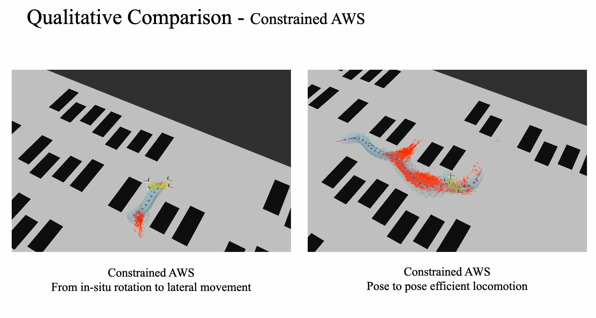

# Planning for all all-wheel-steering vehicles
Repository for paper "A Generic Trajectory Planning Method for Constrained All-Wheel-Steering Robots"

<!-- HD video can be found at https://youtu.be/IM7bY6Y7yms?si=2BEiRhaq9E06Fee2. -->
[](https://www.youtube.com/watch?v=IM7bY6Y7yms?si=5_kNfNoYy-DbkgQg)

Operating instructions:

- Download and install NVIDIA Omniverse issac Sim
    - use isaac Sim open `metrocity_with_AGV.usd`

- Installing ros noetics
    - put file in src in your src folder of workspace.

- Installing required python environments by `conda env create -f environment.yml`

- Installing required pkgs by `sudo apt install libompl-dev` and refer to `hastar_path_planner/package.xml`

- Launch peripheral modules
    ```
    cd src/aws_control
    python plan_utils/ros_interface.py # to bridge the control velocity commands and wheel status
    python path_follower.py # to launch the path smoothing and following module

    ```

- Launch hybrid A star for AWS
    - `source devel/setup.bash && roslaunch hybrid_astar manual.launch` 
    - set goal pose by pressing `g` on keyboard and left click in rviz

# Thanks

- The hybrid_path_planner is developed refer to https://github.com/karlkurzer/path_planner (Author: Karl Kurzer)